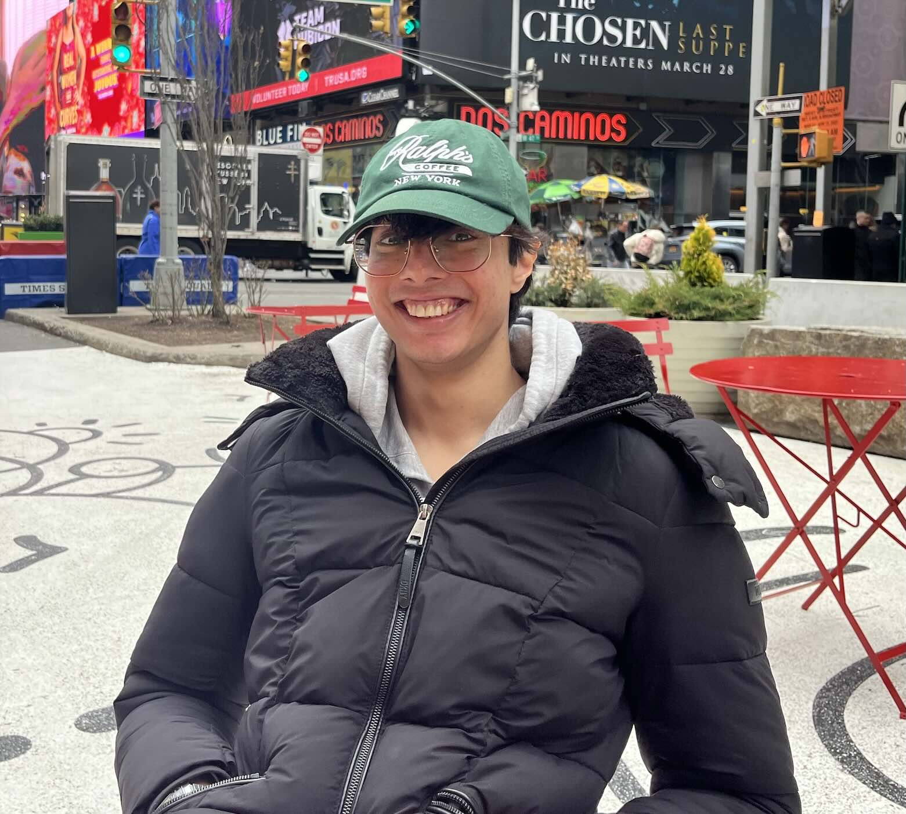

# 🌌 Daksh Bhatt - Astrophysicist Portfolio

<div align="center">
  
  
  ### *Exploring the cosmos through computational astrophysics and stellar dynamics*
  
  [](https://dakshbhatt.in)
  [](https://dakshnbhatt.github.io/portfolio-website/)
  [](#license)
</div>

## 🚀 About This Portfolio

This is my personal portfolio website showcasing my journey as an astrophysicist at the University of Massachusetts, Amherst. The site features a cosmic-themed design that reflects my passion for exploring the universe through research in galaxy formation, stellar dynamics, and computational astrophysics.

### ✨ Features

- **🎨 Cosmic Theme**: Beautiful space-inspired design with animations and gradients
- **📱 Responsive Design**: Optimized for all devices and screen sizes
- **⚡ Fast Performance**: Built with Vite for lightning-fast loading
- **🎭 Interactive Elements**: Typewriter effects, hover animations, and smooth transitions
- **📧 Contact Form**: Integrated Formspree for direct communication
- **📄 PDF Downloads**: Direct access to CV, research papers, and presentations
- **🔗 Social Integration**: Links to LinkedIn, GitHub, and ORCID profiles

## 🎯 Website Sections

### 🏠 **Homepage**
- Interactive typewriter welcome message
- Quick navigation to key sections
- Social media links

### 🔬 **Research**
- Detailed research experience with expandable entries
- Links to conference presentations and papers
- Current projects in stellar photometry and dark matter detection

### 📚 **Publications** 
- Academic publications with download links
- Research papers and conference proceedings

### 🌟 **Outreach**
- Science communication activities
- Conference presentations and posters
- Public engagement projects

### ✍️ **Blog**
- Personal reflections on the astrophysics journey
- Behind-the-scenes stories from research

### 📞 **Contact**
- Working contact form powered by Formspree
- Research interests and collaboration opportunities
- Response time information

## 🛠️ Technologies Used

<div align="center">

| Frontend | Styling | Build Tools | Deployment |
|----------|---------|-------------|------------|
|  |  |  |  |
|  |  |  |  |

</div>

### 🔧 Key Integrations
- **Formspree**: Contact form backend
- **Lucide React**: Beautiful icons
- **React Router**: Client-side routing
- **Custom Hooks**: Toast notifications and mobile detection

## 🚀 Getting Started

### Prerequisites
- **Node.js** (v18 or higher) - [Install with nvm](https://github.com/nvm-sh/nvm)
- **npm** (comes with Node.js)

### Installation

1. **Clone the repository**
   ```bash
   git clone https://github.com/dakshnbhatt/portfolio-website.git
   cd portfolio-website
   ```

2. **Install dependencies**
   ```bash
   npm install
   ```

3. **Start development server**
   ```bash
   npm run dev
   ```

4. **Open in browser**
   ```
   http://localhost:8080
   ```

### 🏗️ Build for Production

```bash
# Build the project
npm run build

# Preview the build locally
npm run preview
```

## 📁 Project Structure

```
portfolio-website/
├── src/
│   ├── components/          # Reusable UI components
│   │   ├── ui/             # shadcn/ui components
│   │   ├── Header.tsx      # Navigation header
│   │   ├── Footer.tsx      # Site footer
│   │   └── ...
│   ├── pages/              # Main page components
│   │   ├── Index.tsx       # Homepage
│   │   ├── Research.tsx    # Research experience
│   │   ├── Publications.tsx # Academic publications
│   │   └── ...
│   ├── hooks/              # Custom React hooks
│   ├── lib/                # Utility functions
│   └── ...
├── public/
│   ├── files/              # PDFs and documents
│   ├── lovable-uploads/    # Images and assets
│   ├── social-icons/       # Social media icons
│   └── CNAME              # Custom domain configuration
└── ...
```

## 🌐 Deployment

This website is deployed using **GitHub Pages** with a custom domain:

- **Live Site**: [dakshbhatt.in](https://dakshbhatt.in)
- **GitHub Pages**: [dakshnbhatt.github.io/portfolio-website](https://dakshnbhatt.github.io/portfolio-website/)

### 🔄 Automatic Deployment
- Every push to the `main` branch triggers automatic deployment
- Changes are live within 5-10 minutes
- DNS propagation may take up to 24 hours for custom domain

## 📋 Version Control

This project uses semantic versioning:
- **v0.0.0**: Initial complete portfolio website
- Check [tags](https://github.com/dakshnbhatt/portfolio-website/tags) for version history

## 🤝 Contributing

While this is a personal portfolio, I welcome suggestions and feedback:

1. Open an issue for suggestions
2. Fork the repository for major contributions
3. Create a pull request with detailed description

## 📄 License

This project is licensed under the MIT License - see the [LICENSE](LICENSE) file for details.

## 📞 Contact

- **Website**: [dakshbhatt.in](https://dakshbhatt.in)
- **Email**: [Use contact form](https://dakshbhatt.in/#/contact)
- **LinkedIn**: [Daksh Bhatt](https://www.linkedin.com/in/daksh-bhatt-388478369/)
- **GitHub**: [@dakshnbhatt](https://github.com/dakshnbhatt)
- **ORCID**: [0009-0009-2783-1131](https://orcid.org/0009-0009-2783-1131)

---

<div align="center">
  <i>✨ Exploring the universe, one line of code at a time ✨</i>
  
  **Made with 💜 by Daksh Bhatt**
</div>
